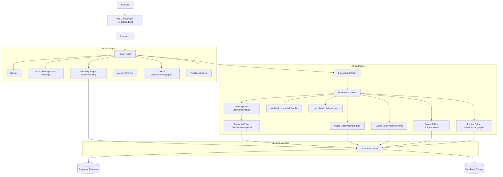

# Project Analysis Report - Thoralby Through Time (T3)

**Date:** January 5, 2026
**Analyst:** Architect Mode Analysis
**Project Type:** React/Vite/TypeScript Historical Website with Supabase CMS

---

## Executive Summary

This report identifies **critical errors**, **misconfigurations**, and **structural issues** found in the Thoralby Through Time project. The analysis covers configuration files, source code, project structure, and documentation.

**Severity Key:**

- 🔴 **Critical** - Breaking issues that prevent functionality
- 🟠 **High** - Significant issues affecting user experience
- 🟡 **Medium** - Issues that should be addressed
- 🟢 **Low** - Recommendations for improvement

---

## 1. Critical Issues

### 1.1 Missing Environment Variables File

**Issue:** The project requires Supabase environment variables but no `.env` or `.env.example` file exists in the project root.

**Affected Files:**

- [`src/lib/supabase.ts`](src/lib/supabase.ts:3-4)
- All admin pages relying on authentication

**Current Behavior:** The application falls back to a mock client when environment variables are missing, which allows development but prevents:

- User authentication
- Content persistence
- Media storage

**Fix Required:**

```bash
# Create .env.example
cp .env.example .env
# Add the following variables:
VITE_SUPABASE_URL=your_supabase_project_url
VITE_SUPABASE_ANON_KEY=your_supabase_anon_key
```

---

### 1.2 Broken Navigation Links

**Issue:** Multiple pages are referenced in navigation components but don't exist or are empty placeholders.

#### Footer Links ( [`src/components/Footer.tsx`](src/components/Footer.tsx:18-58) )

| Link Path | Status | Action Required |
|-----------|--------|-----------------|

| `/about` | ❌ Missing | Create About page |
| `/contribute` | ❌ Missing | Create Contribute page |
| `/people` | ⚠️ Placeholder | Implement People & Families page |
| `/buildings` | ⚠️ Placeholder | Implement Buildings & Places page |
| `/timeline` | ⚠️ Placeholder | Implement Timeline functionality |
| `/gallery` | ⚠️ Placeholder | Implement Gallery functionality |
| `/maps` | ⚠️ Placeholder | Implement Maps functionality |

#### Home Page Links ( [`src/pages/Home.tsx`](src/pages/Home.tsx:120-125) )

| Link Path | Status | Action Required |
|-----------|--------|-----------------|
| `/gallery` | ⚠️ Placeholder | Complete Gallery implementation |
| `/contribute` | ❌ Missing | Create Contribute page |

---

## 2. High Priority Issues

### 2.1 Unused/Obsolete Static Township Pages

**Issue:** The project has both static township pages and a dynamic township system. The static pages are now redundant and contain placeholder content.

**Affected Files:**

- [`src/pages/townships/bishopdale/Bishopdale.tsx`](src/pages/townships/bishopdale/Bishopdale.tsx)
- [`src/pages/townships/thoralby/Thoralby.tsx`](src/pages/townships/thoralby/Thoralby.tsx)
- [`src/pages/townships/burton-cum-walden/BurtonCumWalden.tsx`](src/pages/townships/burton-cum-walden/BurtonCumWalden.tsx)
- [`src/pages/townships/newbiggin/Newbiggin.tsx`](src/pages/townships/newbiggin/Newbiggin.tsx)
- [`src/pages/townships/bishopdale/BishopdaleIndustry.tsx`](src/pages/townships/bishopdale/BishopdaleIndustry.tsx)
- [`src/pages/townships/thoralby/ThoralbyIndustry.tsx`](src/pages/townships/thoralby/ThoralbyIndustry.tsx)
- [`src/pages/townships/burton-cum-walden/BurtonCumWaldenIndustry.tsx`](src/pages/townships/burton-cum-walden/BurtonCumWaldenIndustry.tsx)
- [`src/pages/townships/newbiggin/NewbigginIndustry.tsx`](src/pages/townships/newbiggin/NewbigginIndustry.tsx)

**Problem:**

- Route conflicts between static and dynamic pages
- Inconsistent content loading (some use Supabase, some are static)
- User confusion when editing townships via CMS vs. static files

**Recommended Fix:**

- Remove static township pages from `App.tsx` routes
- Deprecate or remove the static `.tsx` files
- Use only `DynamicTownship.tsx` for all township content

---

### 2.2 Unused HTML File

**Issue:** [`src/nav.html`](src/nav.html) appears to be an old navigation file that's no longer used.

**Details:**

- Contains outdated navigation structure with hardcoded external URLs
- Not referenced in any component
- Should be removed or archived

---

### 2.3 TypeScript Strict Mode Violations

**Issue:** `tsconfig.app.json` has strict linting enabled but multiple files have unused imports.

**Configuration ( [`tsconfig.app.json`](tsconfig.app.json:18-21) ):**

```json
{
  "noUnusedLocals": true,
  "noUnusedParameters": true
}
```

**Examples of Unused Code:**

#### [`src/pages/admin/TownshipEditor.tsx`](src/pages/admin/TownshipEditor.tsx:4)

```typescript
import { ArrowLeft, Save } from 'lucide-react';
// Only 'Save' is used, 'ArrowLeft' is unused
```

#### [`src/pages/townships/bishopdale/Bishopdale.tsx`](src/pages/townships/bishopdale/Bishopdale.tsx)

Multiple imports from `lucide-react` may be unused in the file.

---

## 3. Medium Priority Issues

### 3.1 Incomplete Admin Pages

**Issue:** Several admin pages exist but have minimal implementation:

| File | Status |
| ------ | -------- |
| [`src/pages/admin/EventsEditor.tsx`](src/pages/admin/EventsEditor.tsx) | Basic structure, minimal fields |
| [`src/pages/admin/PeopleEditor.tsx`](src/pages/admin/PeopleEditor.tsx) | Basic structure, minimal fields |
| [`src/pages/admin/PhotographsEditor.tsx`](src/pages/admin/PhotographsEditor.tsx) | Basic structure, minimal fields |
| [`src/pages/admin/PagesEditor.tsx`](src/pages/admin/PagesEditor.tsx) | Basic structure, minimal fields |
| [`src/pages/admin/UsersAdmin.tsx`](src/pages/admin/UsersAdmin.tsx) | Basic structure, minimal fields |

**Note:** These are marked as "basic structure" - they need full implementation to be functional.

---

### 3.2 Placeholder Content Pages

**Issue:** Several public-facing pages contain minimal or placeholder content:

| Page | File | Issues |
|------|------|--------|
| People | [`src/pages/People.tsx`](src/pages/People.tsx) | Empty placeholder |
| Buildings | [`src/pages/Buildings.tsx`](src/pages/Buildings.tsx) | Empty placeholder |
| Timeline | [`src/pages/Timeline.tsx`](src/pages/Timeline.tsx) | Empty placeholder |
| Gallery | [`src/pages/Gallery.tsx`](src/pages/Gallery.tsx) | Basic structure, no data |
| Maps | [`src/pages/Maps.tsx`](src/pages/Maps.tsx) | Empty placeholder |
| Contact | [`src/pages/Contact.tsx`](src/pages/Contact.tsx) | Basic structure |
| BishopdaleValley | [`src/pages/BishopdaleValley.tsx`](src/pages/BishopdaleValley.tsx) | Empty placeholder |
| FourTownships | [`src/pages/FourTownships.tsx`](src/pages/FourTownships.tsx) | Empty placeholder |
| OfficialRecords | [`src/pages/OfficialRecords.tsx`](src/pages/OfficialRecords.tsx) | Basic structure |
| Archive | [`src/pages/Archive.tsx`](src/pages/Archive.tsx) | Basic structure |

---

### 3.3 Archive Sub-Pages

**Issue:** Archive sub-pages are mostly empty placeholders:

| Page | File |
|------|------|
| Photographs | [`src/pages/archive/Photographs.tsx`](src/pages/archive/Photographs.tsx) |
| Documents | [`src/pages/archive/Documents.tsx`](src/pages/archive/Documents.tsx) |
| Maps | [`src/pages/archive/Maps.tsx`](src/pages/archive/Maps.tsx) |
| PeopleFamilies | [`src/pages/archive/PeopleFamilies.tsx`](src/pages/archive/PeopleFamilies.tsx) |
| BuildingsPlaces | [`src/pages/archive/BuildingsPlaces.tsx`](src/pages/archive/BuildingsPlaces.tsx) |

---

### 3.4 Missing Dashboard Links

**Issue:** [`src/pages/admin/Dashboard.tsx`](src/pages/admin/Dashboard.tsx) has icons for features but some don't have corresponding pages:

- "Events" icon (no direct route)
- "Hard Drive" icon (likely MediaLibrary)
- "Shield" icon (UsersAdmin)

---

## 4. Low Priority Issues

### 4.1 Documentation Inconsistencies

**Issue:** [`README.md`](README.md) describes a "clean, static" website but the project now has:

- Supabase CMS integration
- Admin authentication system
- Dynamic content loading

**Recommended Fix:** Update README to reflect current architecture.

---

### 4.2 Duplicate CMS Documentation

**Issue:** Two CMS-related documentation files exist:

- [`CMS_SETUP.md`](CMS_SETUP.md)
- [`cms-integration-plan.md`](cms-integration-plan.md)

These contain overlapping and potentially conflicting information.

---

### 4.3 Vite Configuration

**Issue:** [`vite.config.ts`](vite.config.ts:12-15) has `optimizeDeps` configuration:

```typescript
optimizeDeps: {
  exclude: ['lucide-react'],
  include: ['react-quill', 'quill'],
},
```

**Note:** This configuration should be verified as necessary. The `lucide-react` exclusion may be outdated.

---

### 4.4 ESLint Configuration

**Issue:** [`eslint.config.js`](eslint.config.js) doesn't have any rules configured:

```javascript
rules: {
  // Add/adjust rules as needed; keep blank to use plugin defaults
},
```

**Recommendation:** Add project-specific linting rules.

---

## 5. Configuration Issues

### 5.1 Missing PostCSS Configuration for Production

**Issue:** [`postcss.config.js`](postcss.config.js) doesn't have CSS minification for production builds.

**Current:**

```javascript
export default {
  plugins: {
    tailwindcss: {},
    autoprefixer: {},
  },
};
```

**Recommended:** Add cssnano for production minification.

---

### 5.2 Missing Tailwind JIT Optimization

**Issue:** Tailwind configuration could benefit from:

- Explicit `purge` configuration (though modern Tailwind uses `content`)
- `@tailwindcss/typography` plugin for better prose styling
- Disabled unused core plugins

---

## 6. Error Log Analysis

### 6.1 Existing Error Log ( [`T3 errors.txt`](T3%20errors.txt) )

The project has a pre-existing error log with the following issues:

1. **New Township Creation Issue:**
   - New townships appear in admin list but don't have a public page
   - **Root Cause:** Static township routes vs. dynamic route conflict
   - **Fix:** Remove static routes, rely on dynamic `/townships/:slug` route

2. **Edit Page Content Sync Issue:**
   - Township edit page doesn't reflect current content
   - **Root Cause:** Data loading/formatting issue in [`TownshipEditor.tsx`](src/pages/admin/TownshipEditor.tsx)
   - The `convertJsonToHtml` function may not properly handle all content types

3. **Route Conflict:**
   - Both `/townships/:slug` (dynamic) and `/townships/bishopdale` (static) routes exist
   - Static route takes precedence, bypassing database content

---

## 7. Recommended Fixes Summary

### Priority 1 (Critical - Week 1)

1. Create `.env.example` with required Supabase variables
2. Remove static township pages from `App.tsx` routes
3. Fix broken footer links (`/about`, `/contribute`)
4. Fix Home page links

### Priority 2 (High - Week 2)

1. Complete DynamicTownship route implementation
2. Fix TownshipEditor content loading/saving
3. Remove or archive `src/nav.html`
4. Remove unused imports causing TypeScript errors

### Priority 3 (Medium - Week 2-3)

1. Implement placeholder pages or remove from navigation
2. Update README.md to reflect current architecture
3. Consolidate CMS documentation
4. Add production CSS minification

### Priority 4 (Low - Ongoing)

1. Add ESLint rules
2. Complete admin page implementations
3. Add Tailwind optimizations
4. Update documentation

---

## 8. Files to Remove

The following files are candidates for removal:

| File | Reason |
|------|--------|
| `src/nav.html` | Unused obsolete HTML file |
| `src/pages/townships/bishopdale/Bishopdale.tsx` | Redundant (use DynamicTownship) |
| `src/pages/townships/thoralby/Thoralby.tsx` | Redundant (use DynamicTownship) |
| `src/pages/townships/burton-cum-walden/BurtonCumWalden.tsx` | Redundant (use DynamicTownship) |
| `src/pages/townships/newbiggin/Newbiggin.tsx` | Redundant (use DynamicTownship) |
| `src/pages/townships/bishopdale/BishopdaleIndustry.tsx` | Redundant (use DynamicTownship) |
| `src/pages/townships/thoralby/ThoralbyIndustry.tsx` | Redundant (use DynamicTownship) |
| `src/pages/townships/burton-cum-walden/BurtonCumWaldenIndustry.tsx` | Redundant (use DynamicTownship) |
| `src/pages/townships/newbiggin/NewbigginIndustry.tsx` | Redundant (use DynamicTownship) |
| `cms-integration-plan.md` | Duplicated by CMS_SETUP.md |
| `To Do.txt` | Outdated todo file |
| `t3-old.png` | Obsolete image |

---

## 9. Architecture Diagram



---

## 10. Conclusion

The Thoralby Through Time project has a solid foundation with React, TypeScript, Tailwind CSS, and Supabase integration. However, there are several issues that need attention:

1. **Environment configuration** is incomplete
2. **Route conflicts** between static and dynamic pages
3. **Broken navigation** with missing pages
4. **Inconsistent content** across static vs. dynamic pages
5. **TypeScript errors** from unused code

Following the recommended fixes will resolve these issues and create a cohesive, functional historical website.

---

*Report generated by Architect Mode Analysis
